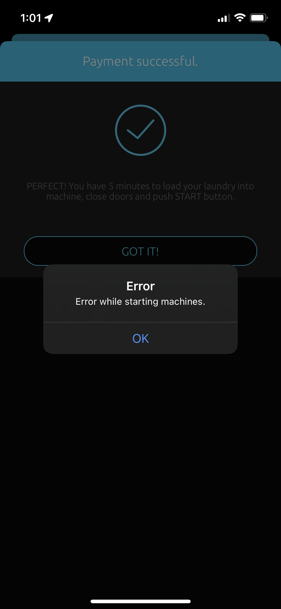

# What is this?

This is a POC on getting free washing at a university that uses the JHC washing app, provided by laundryrestart


I've been able to get past the paywall so far by sending a bogus http page back to the app, `{"status":"paid"}` as the mobile application is constantly making get requests to the below endpoint:
```bash
https://mobile.laundryrestart.com/jhclaundry/api/checkout/check-payment/67835
```

Currently the only one that's worked is: `reply.py` where when running mitmproxy 
```bash
 mitmweb -s reply.py 
```

We're able to push through the payment like below, and then we get a new error:

This is the HTTP response to the error:

```json
{
    "errors": [
        "Order is not set"
    ],
    "status": false
}
```

So from what I can see, we some how need to take control of the requests below:

```
POST https://mobile.laundryrestart.com/jhclaundry/api/checkout/start-cc-transaction

form[store_card]:      0
form[x]:               0
form[use_stored_card]: 0
```
And the response being (where 67835 is the Payment ID)
```json
{
    "payment_id": 67835,
    "payment_status": "redirect",
    "success": true,
    "url": "https://mobile.laundryrestart.com/jhclaundry/realex/init?payment_id=realex-67835"
}
```